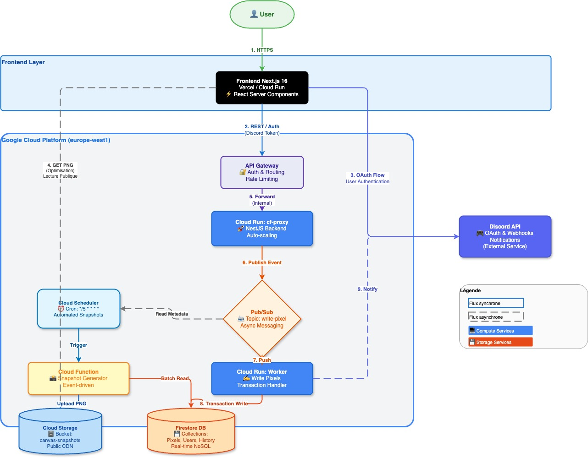

<div align="center">
  

  # PixelHub

  **A collaborative pixel canvas inspired by r/place**

  Built with serverless architecture on Google Cloud Platform

  [](https://cloud.google.com/run)
  [](https://nextjs.org)
  [](https://www.typescriptlang.org/)

</div>

---

## Overview

PixelHub is a fully serverless collaborative pixel canvas where users draw
pixels via Discord slash commands and a web interface, backed by an
event-driven pipeline on Google Cloud Platform.

Built with NestJS (backend proxy), Next.js 16 (frontend), Terraform (IaC),
and Firebase/Firestore (data).

### Key Features

- **Collaborative Canvas**: Configurable-size pixel canvas shared by all users
- **Real-time Updates**: Firestore `onSnapshot` for live pixel placement
- **Discord Integration**: Slash commands via Interactions API (serverless)
- **Discord Authentication**: OAuth2 integration for user management
- **Cooldown System**: Configurable rate limiting (default: 1 pixel per 3s, admin-adjustable via `/set_cooldown`)
- **Cloud Native**: 100% serverless on Google Cloud Run
- **Docker**: Multi-stage Alpine builds for optimized deployments
- **Modern Stack**: Next.js 16, React 19, TypeScript, Tailwind CSS v4

## Architecture

```
Discord / Web Client
        |
        v
  [API Gateway]
        |
        v
  [cf-proxy (NestJS on Cloud Run)]
        |
        +---> [write-pixel-requests]  ---> [write-pixels-worker]
        +---> [discord-cmd-requests]  ---> [discord-cmd-worker]
        +---> [snapshot-requests]     ---> [canvas-snapshot-generator]
```

The frontend reads canvas state in **real-time** via Firebase Client SDK
(`onSnapshot`), bypassing the proxy for reads.

<div align="center">
  
</div>

### Design Principles

- **100% serverless**: Cloud Run, Pub/Sub, Firestore, Cloud Storage
- **Event-driven**: Proxy acknowledges requests, publishes to Pub/Sub
- **Discord Interactions API**: No gateway SDK (discord.js/discord.py)
- **Least-privilege IAM**: Dedicated service account per function
- **IaC**: Terraform manages all infrastructure

## Project Structure

```
cervelet/
├── backend/                          # NestJS proxy API (Cloud Run: cf-proxy)
│   └── src/
│       ├── discord/                  # Discord Interactions handler
│       ├── firestore/                # Firebase Admin SDK wrapper
│       └── functions/                # Independently deployable services
│           ├── write-pixels-worker/  # Pub/Sub -> Firestore pixel writes
│           ├── discord-cmd-worker/   # Discord command processor
│           ├── canvas-snapshot-generator/ # Firestore -> PNG snapshots
│           └── firebase-auth-token/  # Discord -> Firebase custom tokens (routed via API Gateway)
├── frontend/                         # Next.js 16 (App Router, standalone)
│   ├── app/                          # Pages, layouts, API routes
│   ├── components/                   # React components
│   ├── hooks/                        # Custom hooks (real-time canvas, etc.)
│   └── lib/                          # Shared utilities
├── infrastructure/terraform/         # Terraform IaC
│   └── modules/
│       ├── api-gateway/              # API Gateway + OpenAPI spec
│       ├── cloud-run/                # All Cloud Run services
│       ├── firestore/                # Firestore database + indexes
│       ├── pubsub/                   # Topics + push subscriptions + DLQs
│       ├── secrets/                  # Secret Manager
│       ├── storage/                  # Cloud Storage (snapshots)
│       ├── scheduler/                # Cloud Scheduler (periodic snapshots)
│       └── monitoring/               # Alerts + dashboard
├── scripts/                          # Build/deploy/setup scripts
├── docs/                             # Documentation
├── firestore.rules                   # Firestore security rules
└── firestore.indexes.json            # Composite index definitions
```

## Quick Start

### Prerequisites

```bash
brew install terraform pnpm       # macOS
gcloud auth login
gcloud config set project serverless-488811
gcloud auth application-default login
```

### Local Development

```bash
# Backend proxy
cd backend && pnpm install && pnpm start:dev

# Frontend
cd frontend && pnpm install && pnpm dev

# Firebase emulator (optional)
firebase emulators:start
```

### Build All Services

```bash
# Backend proxy
cd backend && pnpm build

# Workers (each is independent)
cd backend/src/functions/write-pixels-worker && pnpm install && pnpm build
cd backend/src/functions/discord-cmd-worker && pnpm install && pnpm build
cd backend/src/functions/canvas-snapshot-generator && pnpm install && pnpm build
cd backend/src/functions/firebase-auth-token && pnpm install && pnpm build

# Frontend
cd frontend && pnpm build
```

### Deploy Infrastructure

```bash
cd infrastructure/terraform
terraform init
terraform plan
terraform apply
```

## GCP Services

| Service          | Resource                    | Purpose                          |
| ---------------- | --------------------------- | -------------------------------- |
| Cloud Run        | `cf-proxy`                  | NestJS backend proxy             |
| Cloud Run        | `write-pixels-worker`       | Pub/Sub pixel writer             |
| Cloud Run        | `canvas-snapshot-generator` | PNG snapshot generator           |
| Cloud Run        | `discord-cmd-worker`        | Discord command processor        |
| Cloud Run        | `pixelhub-frontend`         | Next.js frontend                 |
| Cloud Run        | `firebase-auth-token`       | Discord -> Firebase auth bridge  |
| API Gateway      | `cervelet-api-gateway`      | Public entry point               |
| Pub/Sub          | 4 topics + push subs + DLQs | Async event pipeline             |
| Firestore        | `(default)`                 | Primary database                 |
| Cloud Storage    | `canvas-snapshots`          | PNG snapshots                    |
| Secret Manager   | Discord & Firebase secrets  | Credentials                      |
| Cloud Scheduler  | Snapshot cron (every 5 min) | Periodic snapshot generation     |
| Cloud Monitoring | Alerts + dashboard          | Observability                    |

## Discord Bot Commands

| Command | Type | Description |
|---------|------|-------------|
| `/draw x y color` | User | Place a pixel at (x, y) with a hex color |
| `/snapshot` | User | Generate and display a PNG snapshot of the canvas |
| `/canvas` | User | Show canvas info (size, status, pixel count, cooldown) |
| `/help` | User | Display available commands |
| `/allo` | User | Ping the bot |
| `/session start\|pause\|reset` | Admin | Control canvas session state |
| `/clear` | Admin | Delete all pixels and reset the canvas |
| `/resize width height` | Admin | Change canvas dimensions |
| `/lock` | Admin | Pause the canvas (block new pixels) |
| `/unlock` | Admin | Resume the canvas |
| `/set_cooldown seconds` | Admin | Set per-user cooldown between pixel placements |

## Scripts

```bash
./scripts/deploy-db.sh                    # Deploy Firestore rules/indexes
./scripts/deploy-firestore-indexes.sh     # Deploy composite indexes only
./scripts/push-secrets.js                 # Push .env vars to Secret Manager
./scripts/setup-firestore-credentials.sh  # Set up service account credentials
./scripts/deploy-discord-commands.ts      # Register Discord slash commands
```

## Documentation

- [Documentation Index](docs/README.md)
- [Architecture Diagrams](docs/architecture.md) -- cloud services, event pipeline, auth flow, Pub/Sub, data model, IAM
- [Firestore Setup Guide](docs/database/firestore-setup.md)
- [Firestore Data Model](docs/database/firestore-data-model.md)
- [OAuth Authentication](docs/oauth-authentication.md)
- [Firebase Auth + Discord Setup](docs/firebase-auth-discord-setup.md)
- [Cloud Storage Setup](docs/cloud-storage-setup.md)
- [Real-time Canvas Setup](docs/realtime-canvas-setup.md)
- [Frontend Pixel Writing](docs/frontend-pixel-writing.md)
- [cf-proxy Deployment](docs/deploy_cf_proxy.md)
- [DNS Setup Guide](docs/DNS-SETUP-GUIDE.md)

## Live URLs

| Service | URL |
|---------|-----|
| Web Frontend | https://pixelhub-frontend-164028691762.europe-west1.run.app |
| API Gateway | https://cervelet-api-gateway-gateway-23cqg4ky.ew.gateway.dev |
| Canvas Snapshot | https://storage.googleapis.com/serverless-488811-canvas-snapshots/canvas/latest.png |

## Security

### Frontend Security Headers
- Content Security Policy (CSP)
- XSS Protection
- Frame Options (Clickjacking prevention)
- Referrer Policy
- Permissions Policy

### Authentication
- Discord OAuth2 with CSRF state parameter
- Firebase Custom Tokens via verified Discord access tokens
- `server-only` guard on server-side secrets

### Infrastructure
- Firestore security rules
- Dedicated service account per function (least privilege)
- Secrets in GCP Secret Manager (never in code)
- HTTPS for all public traffic

## Team

Project by Epitech students for the C3: Cloud-Native & Serverless module.
