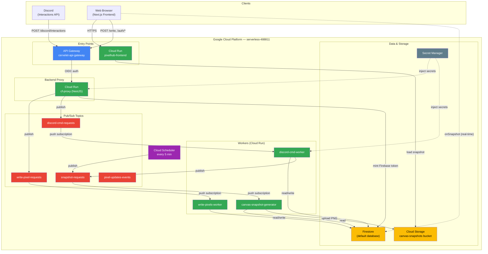
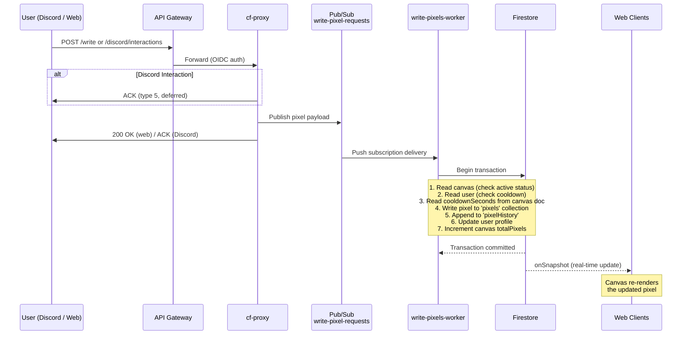
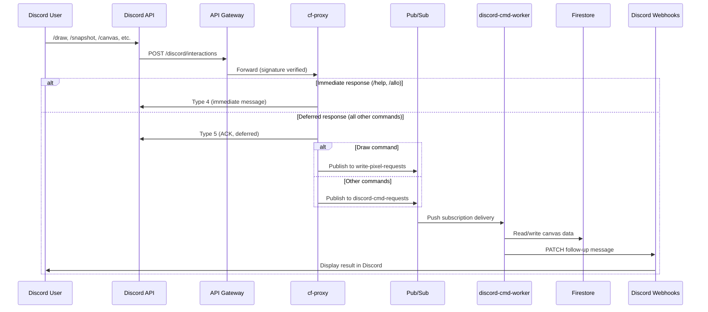
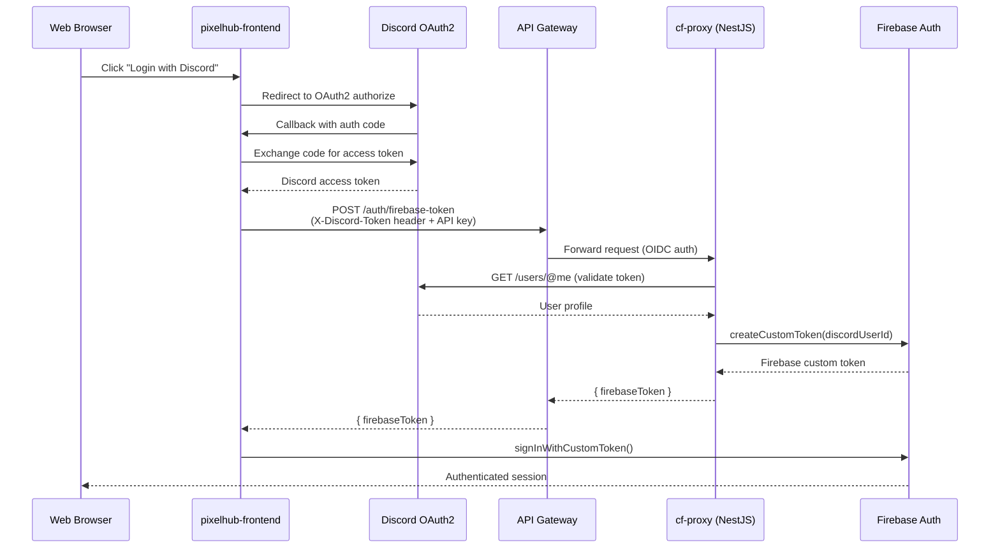
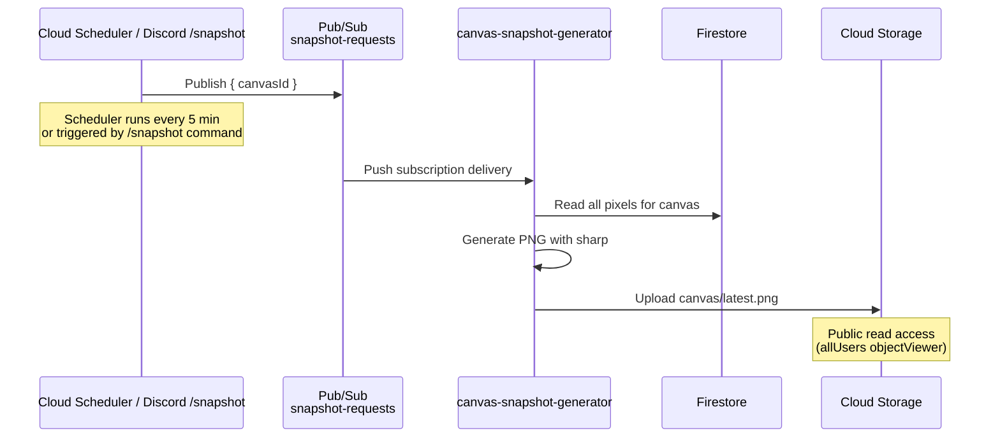
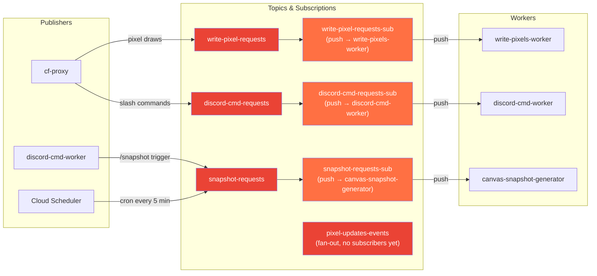
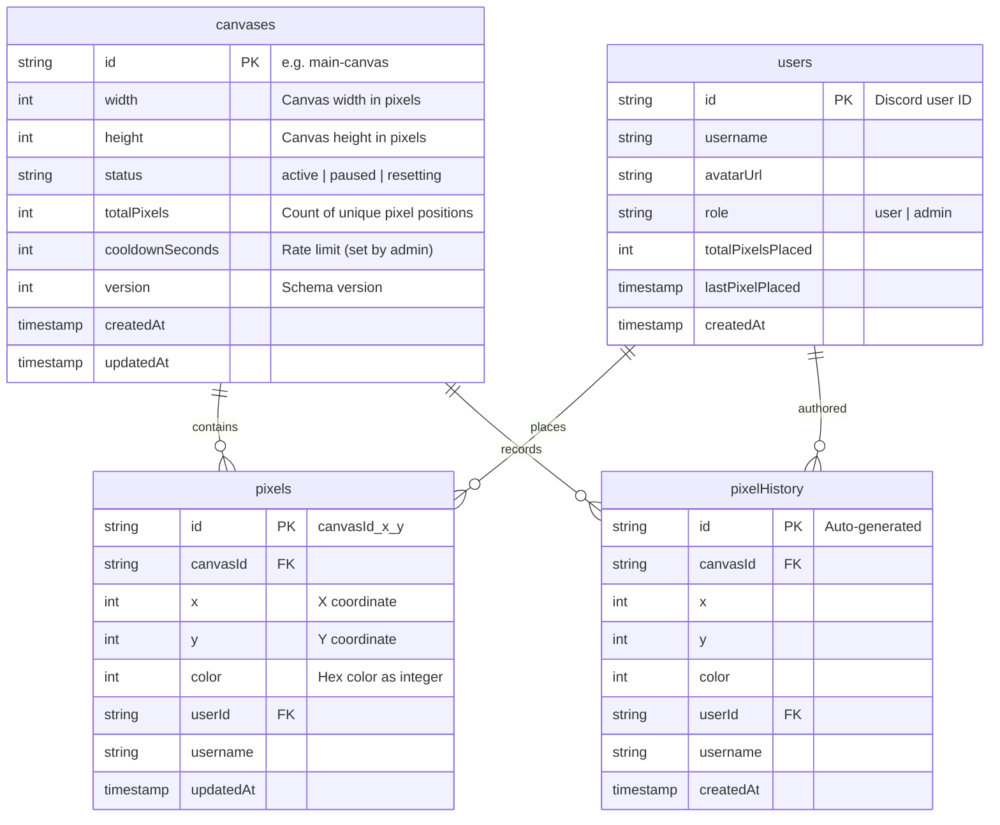
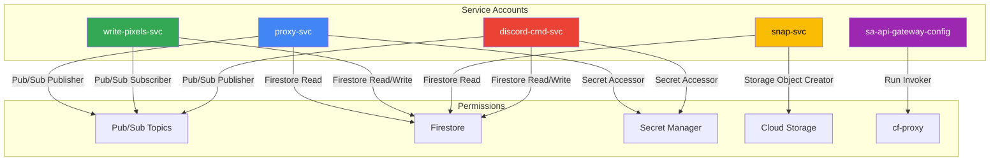

# PixelHub Architecture

## 1. High-Level Cloud Services Overview

## 2. Event-Driven Data Flow — Pixel Write Pipeline

## 3. Discord Slash Command Pipeline

## 4. Authentication Flow (Discord OAuth2 → Firebase)

## 5. Canvas Snapshot Pipeline

## 6. Pub/Sub Topics and Subscriptions

## 7. Firestore Data Model

## 8. IAM & Service Accounts (Least Privilege)

